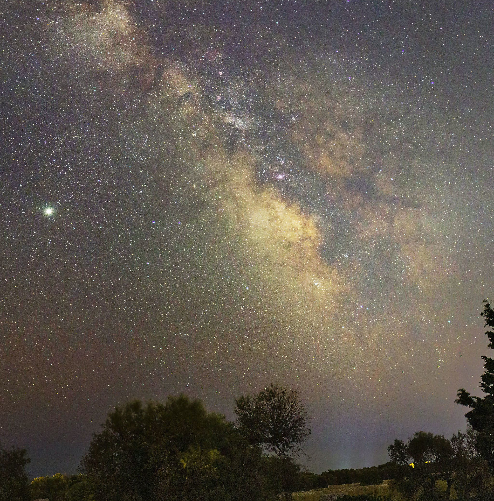
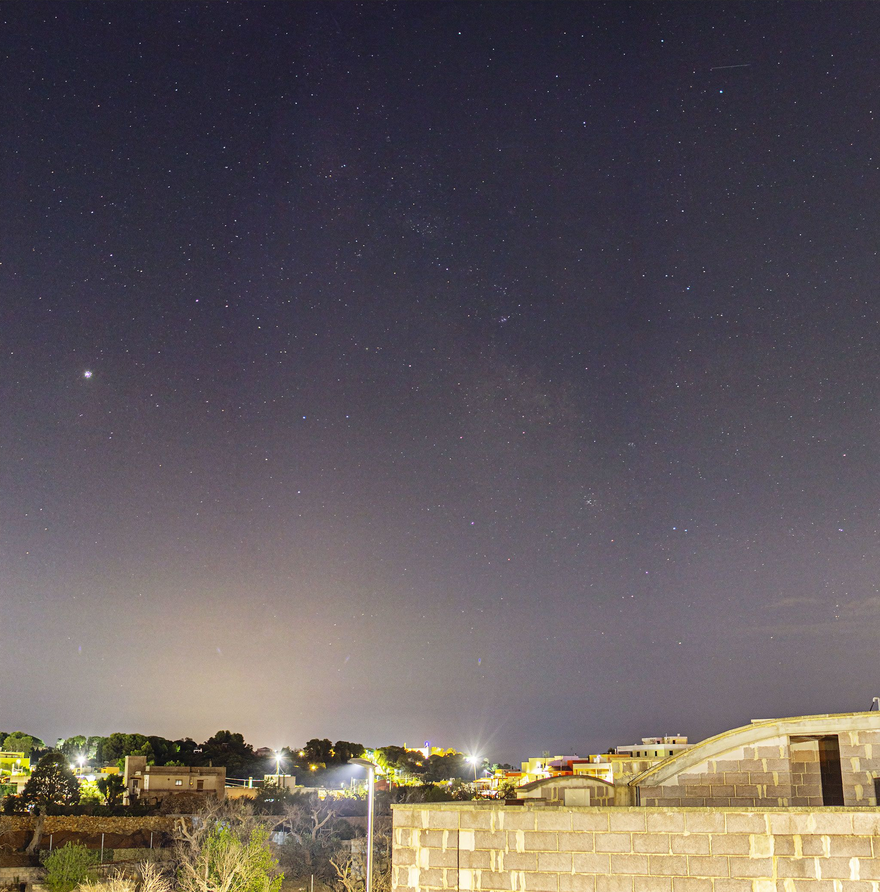
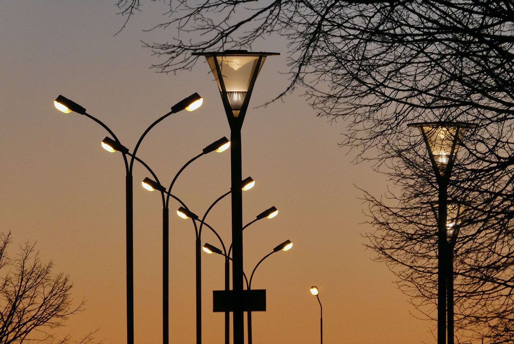
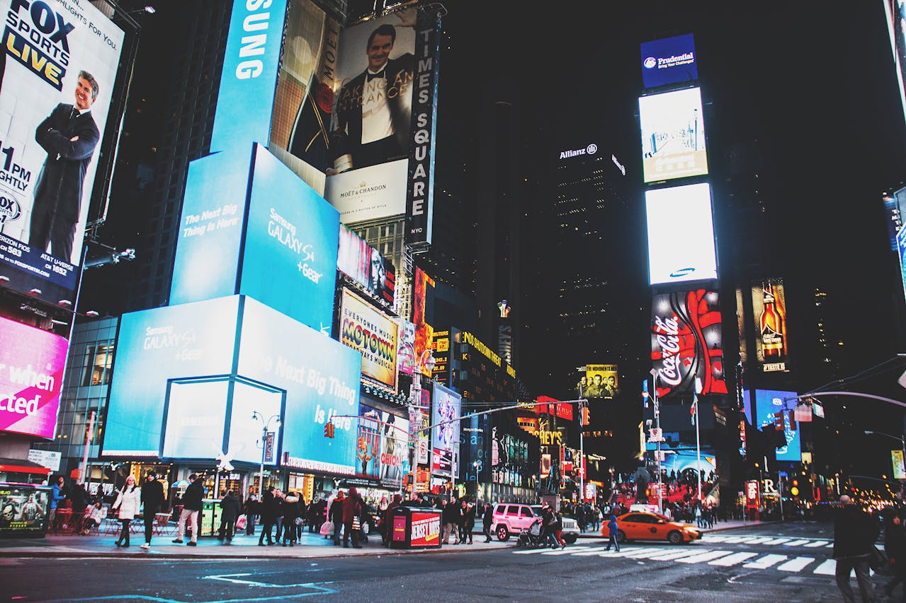
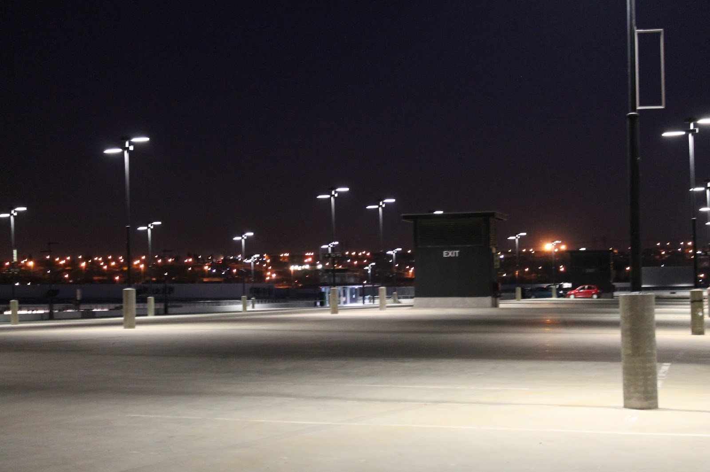

<link
  rel="stylesheet"
  href="https://cdn.jsdelivr.net/npm/img-comparison-slider@8/dist/styles.css"
/>

## Introduction

Have you ever looked up on a clear, moonless night and beheld the beauty of our home galaxy, the Milky Way, across the night sky? If you are able to do this from the comfort of your own backyard, you should consider yourself lucky. Due to light pollution, which plagues urban areas around the world, the majority of people cannot experience such luxury, and are forced to travel potentially hours away from home to catch a glimpse of the Milky Way.

Electric lighting, first invented in the 19th century, is arguably one of the most important of the modern inventions, allowing us to extend our working hours past sunset and long into the night. However, with all of this artificial light at night, some of it will inevitably end up being scattered into the night sky and lost. This scattering of light into the night sky results in an unnatural brightening of the night sky, called skyglow. Also known as light pollution, it affects not only astronomical observations, but also the quality of the lives of both people and wildlife.

<figure>
  
    
    
  </img-comparison-slider>
  <figcaption>Figure 1: The effect of light pollution on the night sky. (drag to compare images)</figcaption>
  Image source: <a href="https://www.pinterest.com/pin/i-made-this-comparison-to-show-how-much-light-pollution-reduces-the-visibility-of-the-night-sky--161707442859837910/" target="_blank">Link</a>
</figure>

As urban areas around the world expand, the problem of light pollution will only continue to get worse. The City of Wichita estimates the current population of the Wichita Metropolitan Statistical Area to be over 790,000, and predicts it to grow to over 870,000 by 2035 (<a href="works_cited#5">"Demographics"</a>). With that in mind, the City of Wichita, going forward, should implement strategies to reduce the impact of light pollution on its people and the environment.

## Causes of Light Pollution

While some loss of light into the sky is unpreventable and is to be expected, inefficient lighting practices and poor lighting design exacerbate the problem by unnecessarily allowing large amounts of light to be wasted into the night sky, where it will not be used. DarkSky International notes several common sources of light pollution.

### Unshielded Lighting

Many outdoor light fixtures and street lights are designed inefficiently, allowing a significant amount of the light they produce to be emitted in directions where it will never be used, such as directly into the sky. Such light fixtures are described as *unshielded*, and are one major contributor to light pollution (<a href="works_cited#3">"Causes"</a>).

<figure>
    
    <figcaption>Figure 2: Unshielded street lighting.</figcaption>
    Image source: By Jonn Leffmann, <a href="https://creativecommons.org/licenses/by/3.0" title="Creative Commons Attribution 3.0" target="_blank">CC BY 3.0</a>, <a href="https://commons.wikimedia.org/w/index.php?curid=99834824" target="_blank">Link</a>
</figure>

### Electronic Messaging Centers

Modern electronic messaging systems, or electronic billboards, are another major source of light pollution. Combined with their increased brightness over traditionally-illuminated billboards, their inability to be effectively shielded allows them to radiate significant abounts of light into the night sky (<a href="works_cited#3">"Causes"</a>).

<figure>
    
    <figcaption>Figure 3: Electronic Messaging Centers.</figcaption>
    Image source: By Helena Lopes, <a href="https://www.pexels.com/photo/busy-street-during-nighttime-1862000/" target="_blank">Link</a>
</figure>

### Unused Light Fixtures Left Running

Since light pollution is simply the result of artificial light being scattered into the atmosphere, any amount of artificial light contributes to light pollution. Through light reflected off objects, even properly shielded light fixtures contribute to light pollution when left illumminated while not in use. Figure 5 shows an almost empty parking lot illuminated with properly shielded light fixtures. Even with the shielding, the parking lot surface still reflects a significant amount of light into the sky. 

<figure>
    
    <figcaption>Figure 4: Empty parking lot reflecting light from above back into the sky.</figcaption>
    Image source: By Allen Versfield, <a href="https://creativecommons.org/licenses/by/4.0" title="Creative Commons Attribution 4.0" target="_blank">CC BY 4.0</a>, <a href="https://lossofthenight.blogspot.com/2015/" target="_blank">Link</a>
</figure>

Light fixtures which are brighter than necessary for their intended use case are another contributor to light pollution.
